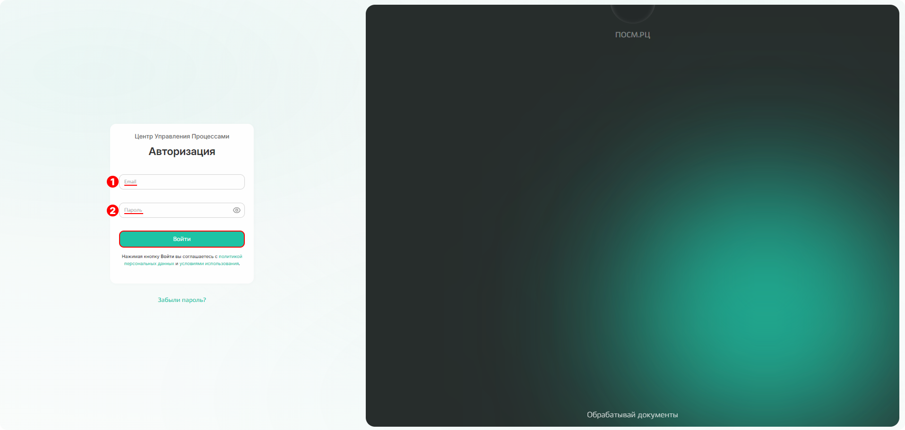
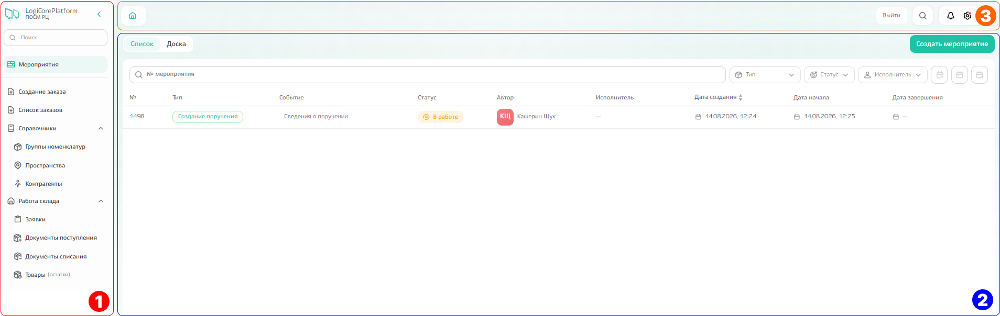
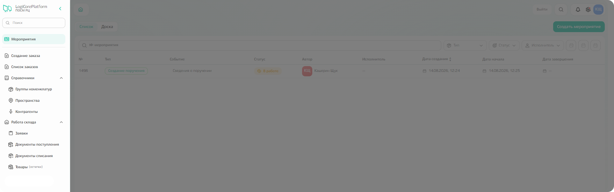
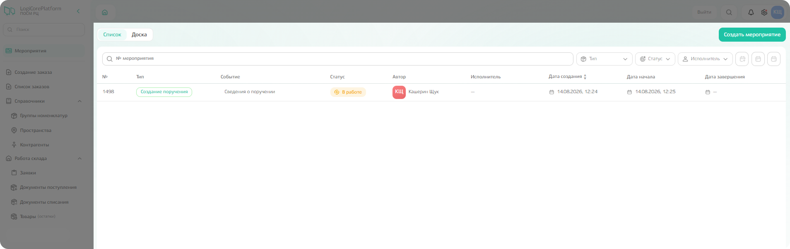
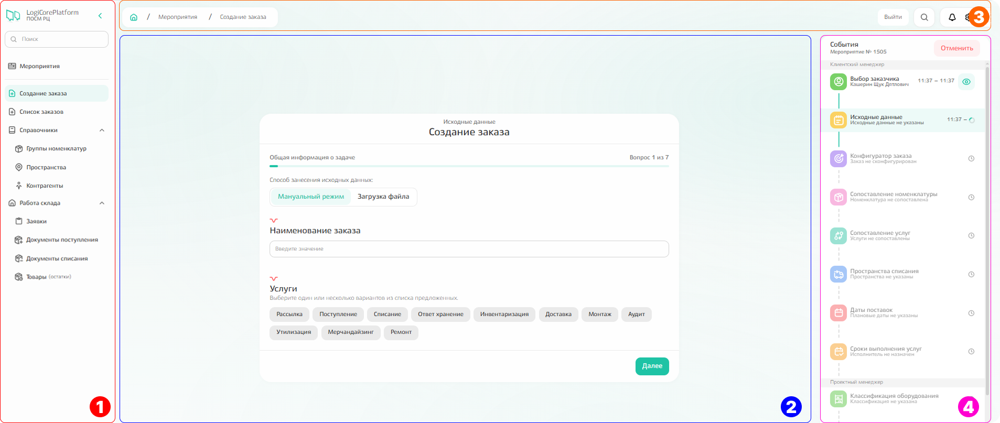
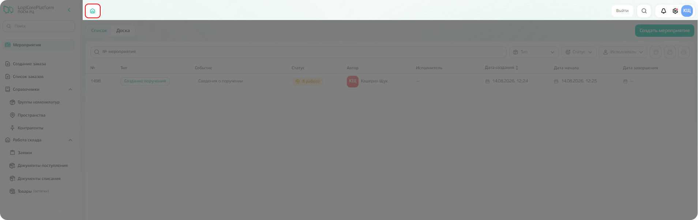

# Начало работы

## Вход в систему

Перед началом работы необходимо войти в систему: для этого введите электронную почту(1) и пароль(2), который получили ранее для доступа в личный кабинет, и кликните по кнопке «Войти». 

{.center width=1200}

## Главная страница

После авторизации происходит **переход к главной или стартовой странице.** 

Визуально страницу можно разделить на 3 части: боковое меню(1), рабочая область(2) и верхнее меню(3).

{.center width=1200}

Из **бокового меню** слева можно перейти к 
- списку мероприятий (он же — главная или стартовая страница, где мы сейчас находимся); 
- созданию заказа;
- списку заказов;
- справочнику номенклатуры;
- справочнику пространств;
- справочнику контрагентов;
- списку заявок;
- документам поступления;
- документам списания;
- товарным остаткам. 
Взаимодействие с данными подсистемами описано отдельно. 

{.center width=1200}

В **рабочей области располагается список мероприятий**. 
К мероприятиям относятся практически все действия, которые происходят в системе: создание заказа и поручения, оформление заявок на поступление и списание и так далее. 



В списке **отображаются только те мероприятия, которые связаны с вами**: вы являетесь автором или исполнителем мероприятия.



{.center width=1200}

Мероприятия состоят из связанных между собой действий или событий, которые необходимо выполнить, чтобы завершить мероприятие. При клике по мероприятию с типом «создание заказа» и «создание поручения» появляется графическая визуализация последовательности событий в дополнительном блоке справа(4).

{.center width=1200}

**Верхнее меню** включает:
- название открытой вкладки или иконку домашней страницы (возврат к списку мероприятий);
- кнопку «Выйти» — для выхода из системы;
- поиск.



**Уведомления, настройки, аватарка личного личного профиля пока находится в разработке**: при клике в данной области ничего не произойдёт.



{.center width=1200}

## Алгоритм работы

Работа в системе выстроена по иерархическому принципу: документы связаны между собой и создаются на основании друг друга.

**Основа — договор.** К нему могут прилагаться приложения и дополнительные соглашения — они уточняют и дополняют условия, прописанные в основном тексте договора. Договоры вносят в систему HR‑менеджеры. Как клиентский менеджер, вы можете просматривать свой договор, а также договоры контрагентов, в чьих интересах ведёте работу, — в рамках установленных прав доступа.

**На базе договора вы формируете поручение** (порядок создания описан в отдельно). Поручение служит основанием для создания:
- **заказов** — они становятся отправной точкой для формирования операционных задач;
- **заявок** — на их основе оформляют поступление или списание номенклатуры, а также фиксируют движение товарно‑материальных ценностей.
Таким образом, документы образуют единую связанную цепочку — ни один из них не существует изолированно.

### Порядок действий
1. Ознакомьтесь с договором в карточке контрагента.
2. Создайте поручение.
3. На основании поручения сформируйте заказ.
4. Создайте заявку на основании договора. После выполнения заявки автоматически формируются документ поступления либо документ списания.
5. Проверьте товарные остатки: они рассчитываются на основании движения ТМЦ, отражённого в документах поступления и списания.

При необходимости перейдите к разделу инструкции, который описывает нужный для вашей работы функционал.