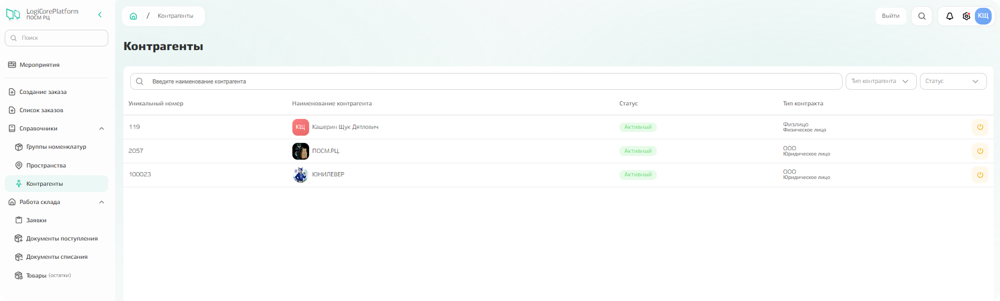
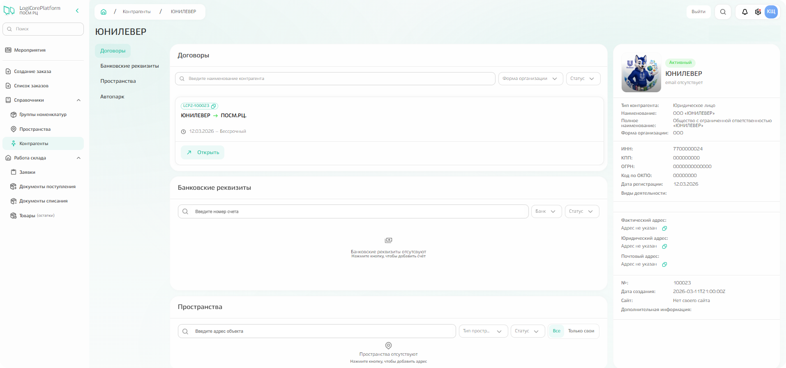
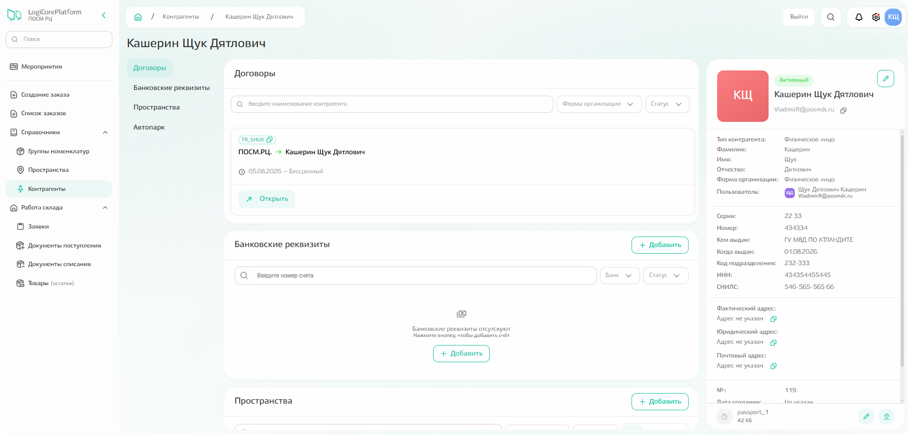

# Контрагенты

В данной подсистеме отображаются контрагенты, с которыми вы можете взаимодействовать:
- вы;
- контрагент, в интересах которого вы выполняете работу (например, Юнилевер или Пепси);
- работодатель, с которым у вас есть заключённый договор (например, ПОСМ.РЦ или Паблик Тотем).

{.center width=1200}

Нажмите на контрагента из списка, чтобы просмотреть общую информацию, информацию о договорах, банковских реквизитах, а также о пространствах и видах транспорта.  

{.center width=1200}



**Карточка контрагента доступна только для просмотра:** редактирование каких-либо данных и деактивация контрагента недоступны.
Если вы заметили несоответствие отображдаемой информации с фактической, необходимо обратиться к HR-менеджеру для внесения изменений. 



**Свои данные вы можете редактировать** — в отличие от данных других контрагентов. 
Чтобы внести изменения, кликните по своей строке в списке: откроется карточка, где можно обновить ФИО, контактный телефон, электронную почту и паспортные данные, а также добавить банковские реквизиты и сведения о закреплённых пространствах и транспортных средствах (автопарке). 
При этом по‑прежнему **нельзя деактивировать себя как контрагента и внести изменения в договор.** 

{.center width=1200}

