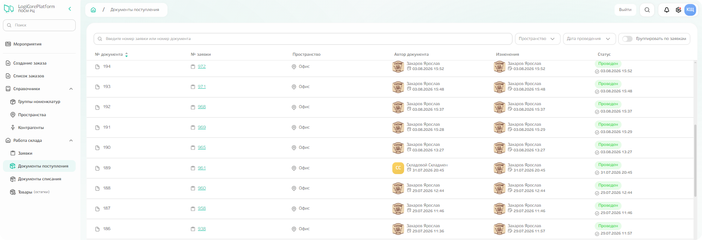
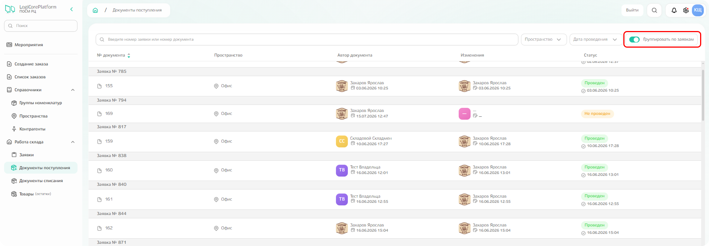
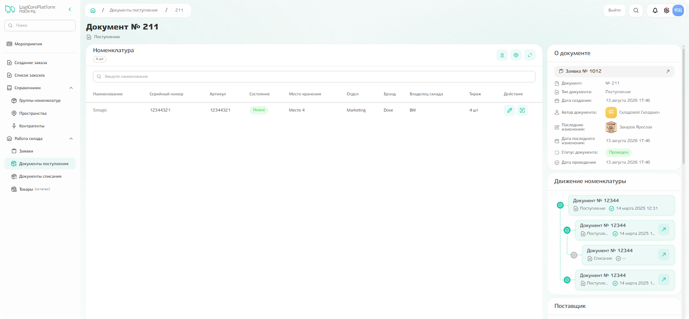
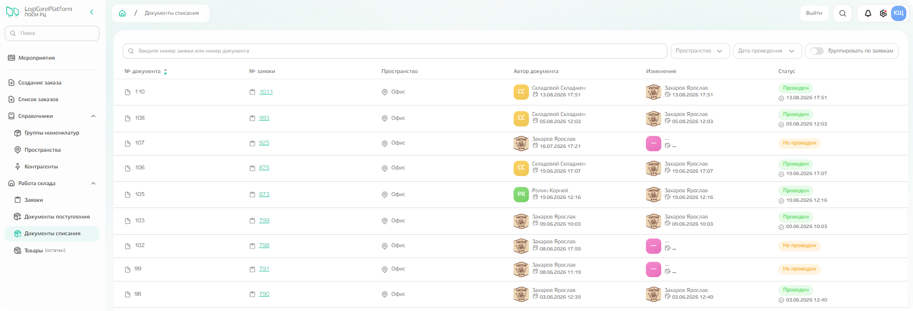

# Документы поступления

Подсистема содержит **все документы, с помощью которых было оформлено поступление товара по заявкам.**

{.center width=1200}

**Документы можно сгруппировать по заявкам,** активировав флажок группировки. 
Кроме того, можно установить фильтр по дате проведения, а также по пространствам поступления или найти конкретный документ в поиске по его номеру. 

{.center width=1200}

**При клике по конкретному документу можно увидеть** информацию о номенклатуре, движениях номенклатуры и общую информацию по документу. 

{.center width=1200}

# Документы списания 

Подсистема содержит все документы, с помощью которых было оформлено списание товара по заявкам.

{.center width=1200}

Функционал аналогичен подсистеме документов поступления: 
- сгруппировать документы по заявкам (активировав флажок группировки);
- найти конкретный документ по номеру;
- отфильтровать документы по пространствам и дате проведения;
- просмотреть информацию о номенклатуре, движениях номенклатуры и общие данные — при клике по документу.
