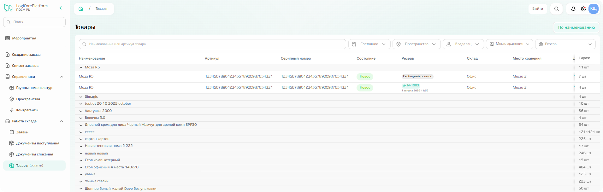
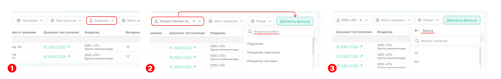
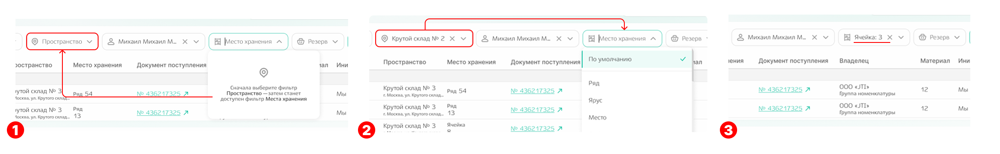

# Товары

В подсистеме «Товары» отражены складские остатки по тем пространствам, к которым у вас есть доступ по договору. 

{.center width=1200}

По каждому товару помимо наименования, артикула, серийного номера и состояния можно посмотреть информацию о:
- **резерве** — зарезервирован ли товарный остаток для какой-то заявки/заказа или хранится без резерва («свободный остаток»);
- **пространстве** и **месте хранения**;
- **номере документа поступления** — при клике по номеру также происходит переход к просмотру информации о документе, на основании которого товар учтён на складе; 
- **владельце** — в пользу какого контрагента осуществляется хранение товарных остатков. 

Можно найти конкретный товар по наименованию или артикулу с помощью поиска или воспользоваться фильтрами для сортировки информации. Все фильтры на странице равнозначны и могут применяться как по отдельности, так и в комбинации друг с другом.

Есть фильтры с прямым вводом или выбором значения:
- **состояние** - брак, б/у или новое;
- **пространство** - выбор среди пространств, доступных для пользователя;
- **резерв** - поиск по номеру заявки или заказа, зарезервировавшие товарный остаток. 

Есть фильтры с более сложной логикой выбора:
- **владелец** - каскадный фильтр, состоящий из двух последовательных шагов:
шаг 1. Выбор контрагента-владельца, которому принадлежит товар;
шаг 2. Выбор группы номенклатуры в рамках этого владельца.
*После выбора владельца становится доступна **команда «Добавить фильтр».***
шаг 3. В выпадающем списке отображаются атрибуты номенклатуры, характерные только для выбранного владельца (например, «Бренд»). После выбора атрибута доступен выбор его конкретных значений (для атрибута «Бренд»: Андекс, Смирные ягоды, Водород).

{.center width=1200}

- **место хранения** - каскадный фильтр, доступный только при выбранном значении в фильтре «Пространство». 
Состоит из двух шагов:
шаг 1. Выбор уровня топологии (например, «Ряд» или «Ячейка»).
шаг 2. Выбор конкретного значения (например, «Ряд №10» или «Ячейка №67»).

{.center width=1200}