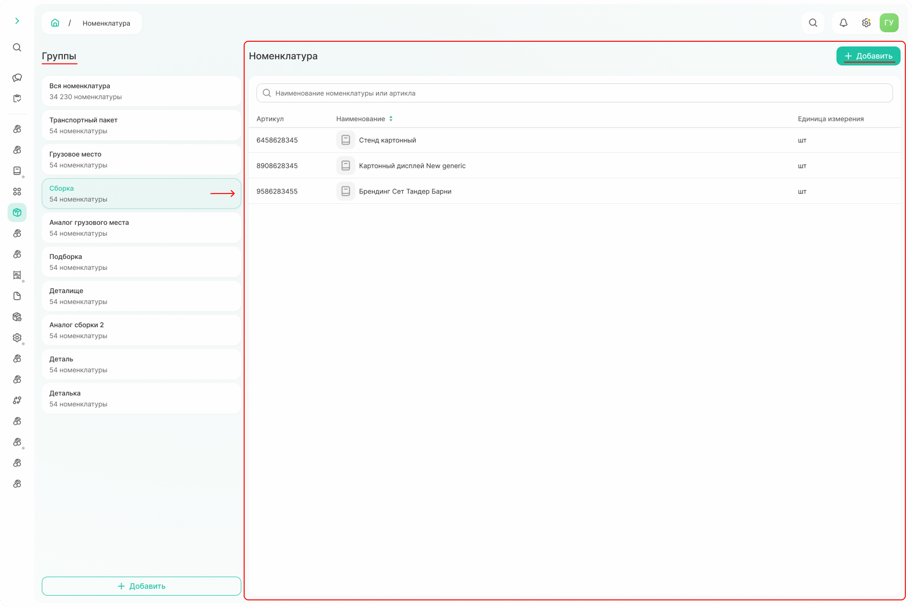
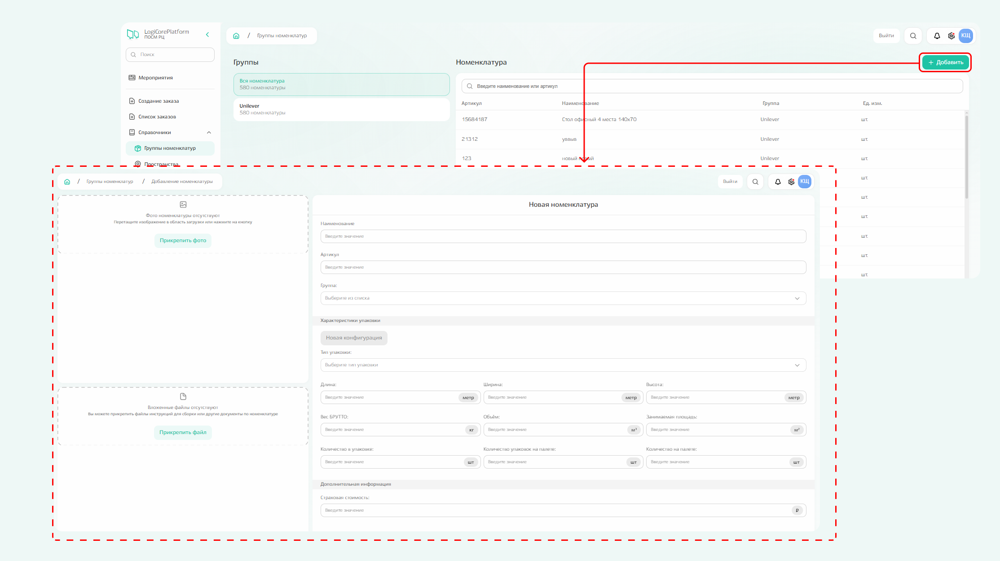
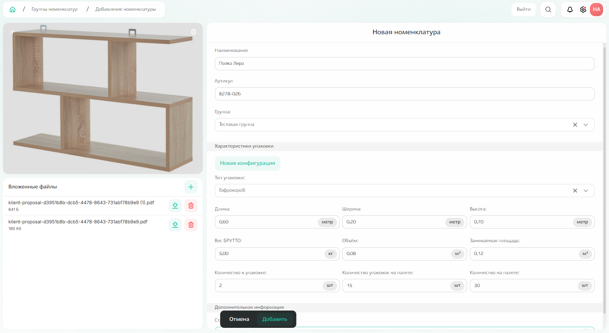
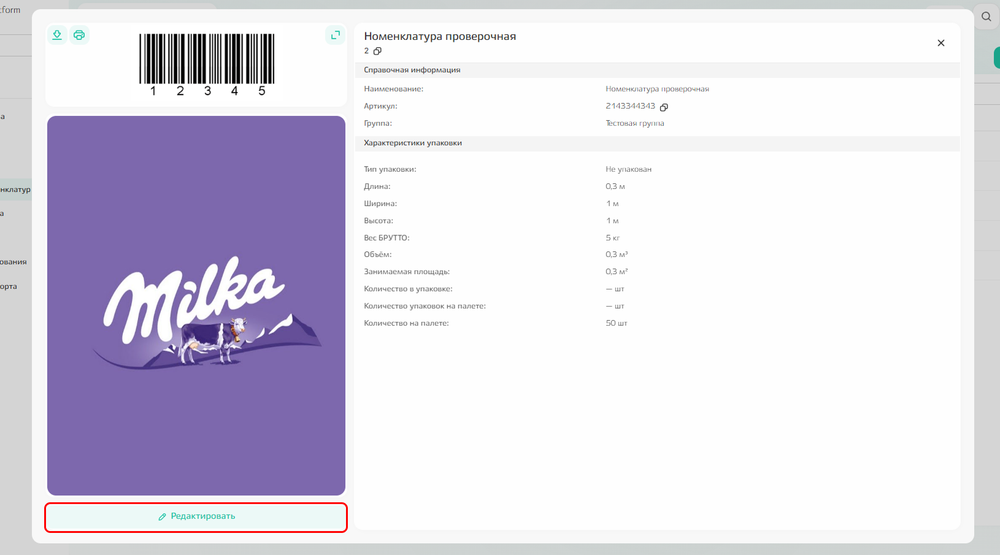
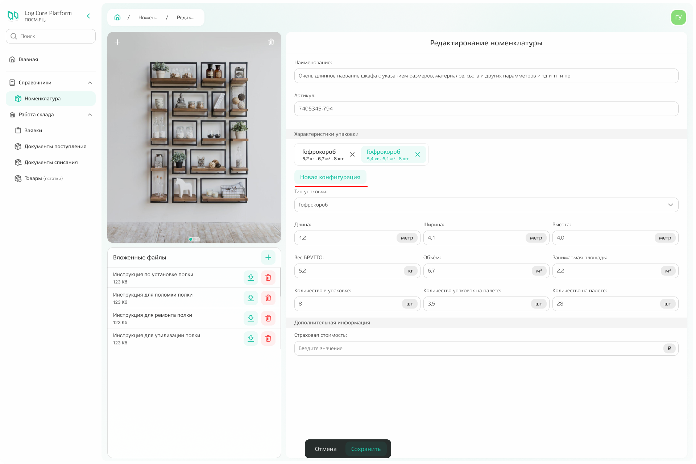

# Справочник «Номенклатура»



**Справочник** — структурированный перечень данных об основных сущностях в системе.

**Группа номенклатур** — справочник клиентских характеристик, требуемых для описания товара.

**Номенклатура** — сводный перечень общих характеристик, необходимый для описания товара или оборудования.



При переходе в подсистему на странице отображается список добавленной ранее номенклатуры. 
Список номенклатуры зависит от выбранной группы. По умолчанию отображается вся добавленная номенклатура. Если выбрать группу, она выделится зелёным, а в списке останутся позиции, относящиеся к только к этой группе.

{.center width=1200}

Можно кликнуть по любому элементу списка, чтобы просмотреть подробную информацию по конкретной номенклатуре. Также на странице **можно добавить новую номенклатуру и изменить существующую.**  



**Удалить номенклатуру нельзя**, но можно изменить информацию об уже внесенной. 



## Добавление номенклатуры

Номенклатура добавляется по команде «Добавить», расположенной над списком номенклатуры. Если в момент добавления выбрана определённая группа, номенклатура автоматически отнесётся к ней.

{.center width=1200}

**У любой номенклатуры необходимо заполнить обязательные поля**: наименование и артикул. 

Рекомендуется заполнить поля с информацией о характеристиках упаковки, в которой поставляется номенклатура, поле страховой стоимости, а также прикрепить фото номенклатуры и связанные с ней файлы. 

После заполнения всех полей нажмите кнопку «Добавить».

{.center width=1200}

## Редактирование номенклатуры

**Чтобы отредактировать номенклатуру,** кликните по конкретному значению из списка и в карточке номенклатуры кликните «Редактировать».

{.center width=1200}

В открывшемся модальном окне можно изменить любое поле, а также добавить новую конфигурацию упаковки с помощью кнопки «Новая конфигурация». 

{.center width=1200}

После добавления нескольких конфигураций в модальном окне появляется несколько вкладок, при переключении между которыми характеристики упаковки меняются. 

{.center width=1200}