# Как создать заказ



**Заказ** — элемент управления, являющийся по сути документом, где описан конкретный объем работ и услуг, подлежащих исполнению.



Создать заказ можно двумя способами:
* из подсистемы «Создание заказа» — начинайте с события «Выбор заказчика»;
* из подсистемы «Список заказов» - по кнопке «Создать заказ» произойдет переход к событию «Выбор заказчика». 

## Заполнение исходной информации

Под **исходной информацией** в рамках данной инструкции по созданию заказа понимается информация о:
- заказчике, договоре и поручении;
- периодах и сроках;
- особенностях монтажа, фото и видеоотчетов, документации;
- контакты;
- дополнительные комментарии и прикрепленные файлы к заказу. 

### Событие 1. Выбор заказчика

Укажите **заказчика**, **договор** и **поручение**.
Без этих данных не получится создать заказ. 

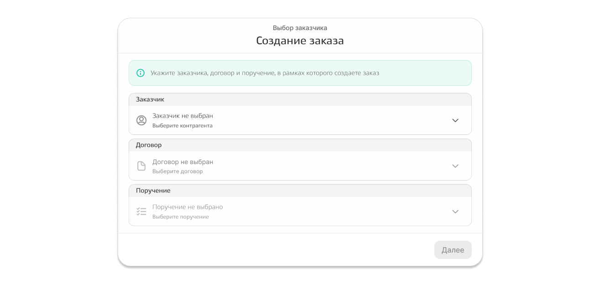{.center width=1200}

### Событие 2. Исходные данные

На данном событии необходимо дать справочные исходные данные, ответив на вопросы для уточнения деталей заказа. Например, требуется ли согласование фото с клиентом или подготовка места установки. 

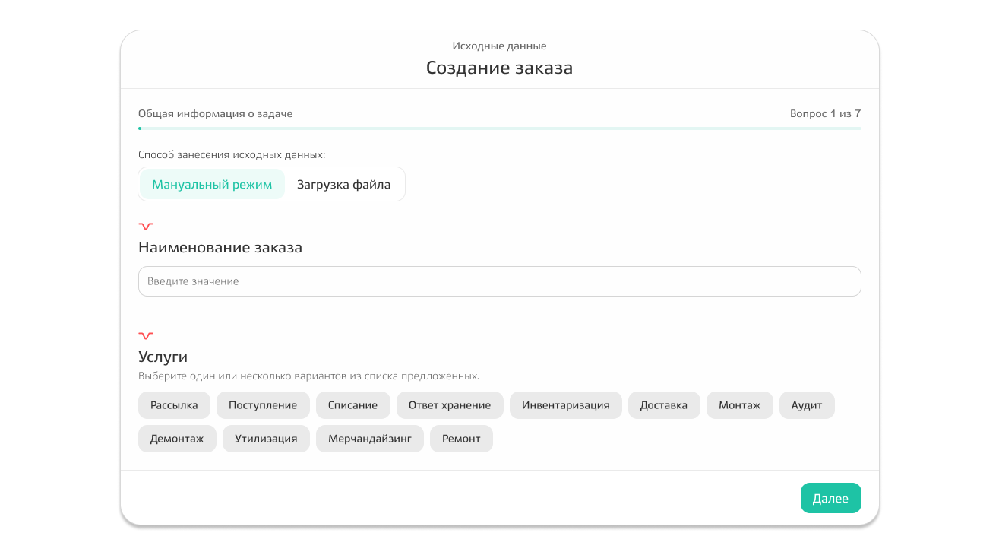{.center width=1200}

Исходные данные можно внести в систему с помощью ручного, последовательного заполнения форм (**«мануальный режим»**): всего будет 7 форм с вопросами. Если не получается перейти к следующей форме по команде «Далее», значит что-то из обязательной информации не заполнено. Такие поля будут подсвечены красным.

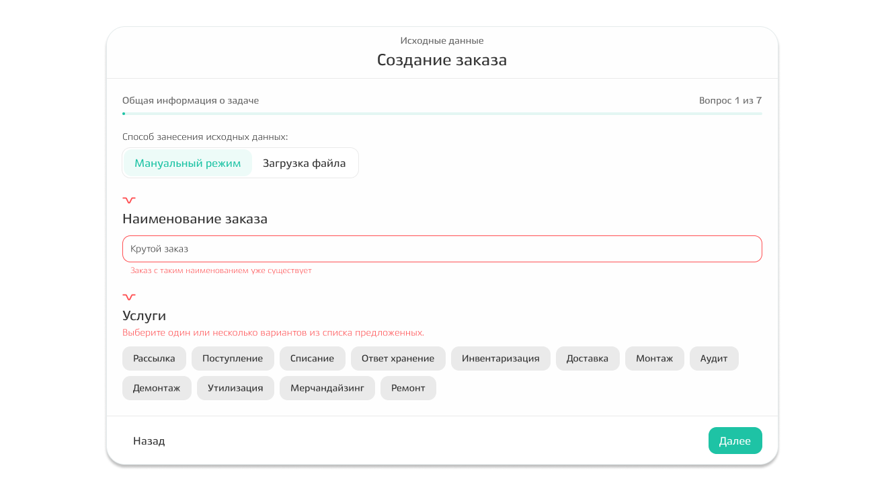{.center width=1200}

Исходные данные также можно внести в систему с помощью загрузки файла со специальным форматом с расширением .json (**«загрузка файла»**): загрузите файл по команде «Прикрепить файл» или перетащив файл в область загрузки. Все поля будут заполнены в соответствии с данными из файла - эти данные необходимо проверить, переключаясь между формами по команде «Далее». 

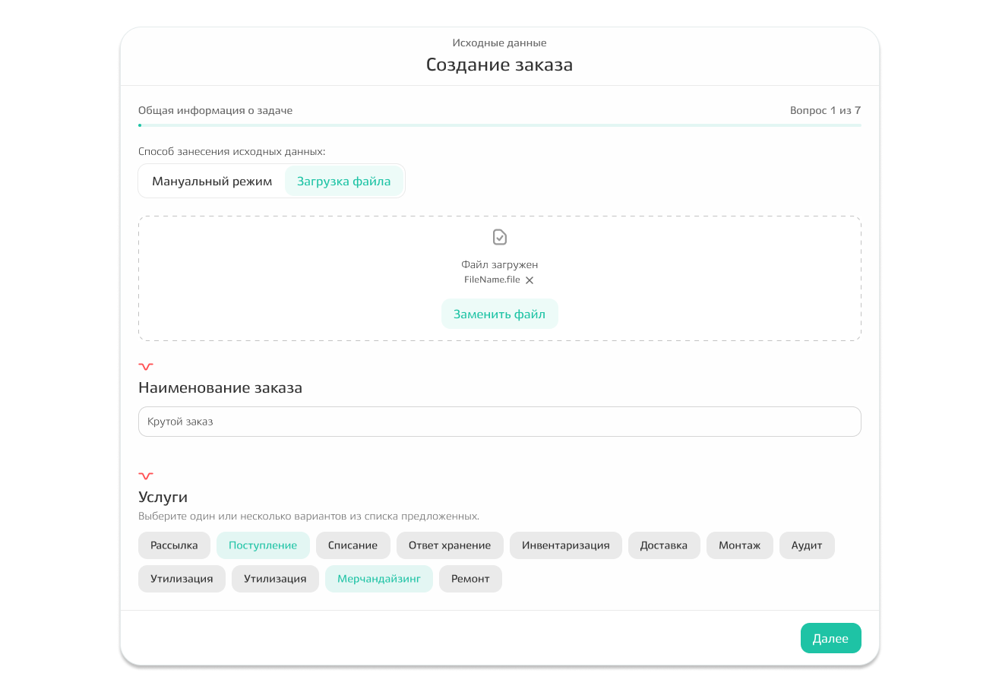{.center width=1200}



Введённые данные будут отражены в левой части экрана для всех последующих событий(1).

Также по каждому событию в мероприятии замеряется время, потраченное на заполнение информации, и сохраняется внесенная информация, которую можно посмотреть по иконке соответствующего события(2).  

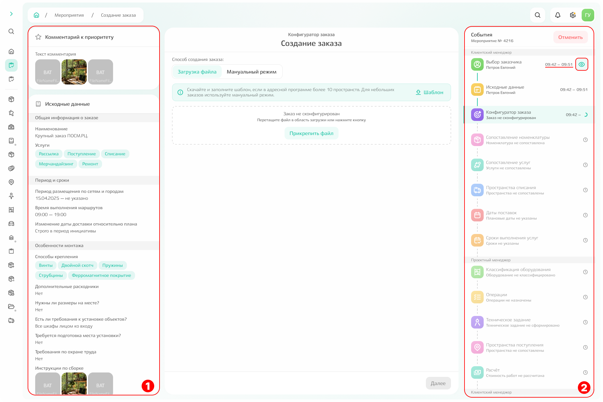{.center width=1200}



## Заполнение первичной информации

Под **первичной информацией** в рамках данной инструкции по созданию заказа понимается информация о:
- пространствах списания;
- датах поставки;
- оборудовании;
- услугах и сроках их выполнения. 

**Состав последующих событий зависит от того, какой способ заполнения информации вы выберете на событии 3 «Конфигуратор заказа».** Следуйте тем инструкциям, которые соответствуют вашему способу загрузки информации: если была выбрана загрузка информации, следуйте сценарию 3.1; если мануальный режим — сценарию 3.2.   

### Событие 3.1.1. Конфигуратор заказа


        
Шаблон рекомендуется использовать, если в адресной программе больше 10 пространств. 
Для небольших заказов используйте мануальный режим (Событие 3.2. Конфигуратор заказа).  
        


**Заполнение и загрузка шаблона**
  1. По команде «Шаблон» скачайте excel-файл. 
  2. Заполните информацию, следуя текстовым подсказкам в файле. Обязательные [поля][9] помечены желтым цветом. 
  3. Загрузите заполненный шаблон по команде «Прикрепить файл» или перетащите в область загрузки. **Можно загрузить только один файл**. 
  
  {.center width=1200}



Последующие события, связанные с загрузкой файла, направлены на проверку правильности сопоставления данных из шаблона с данными из системы.



### Событие 3.1.2. Сопоставление номенклатуры

По наименованию номенклатуры из справочника в системе подбирается номенклатура, из которой оборудование состоит, и требуемое количество для комплектации одного оборудования. 
    


**На текущий момент в системе оборудование может состоять только из одной номенклатуры.** Функционал, позволяющий подобрать больше одной номенклатуры к одному оборудованию, находится в разработке.



Если сопоставление не удалось, замените или добавьте новую номенклатуру в выпадающем списке. 

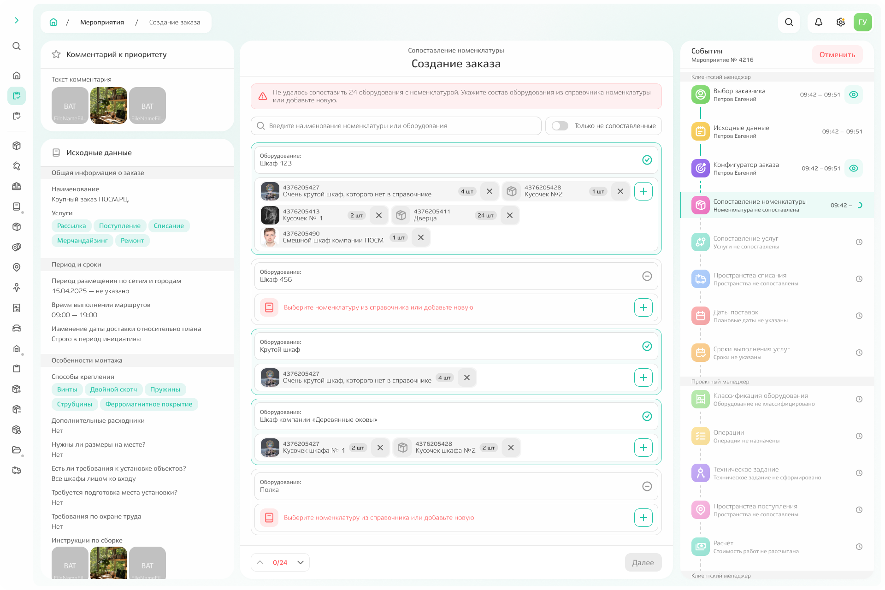{.center width=1200}



Если кликнуть по наименованию номенклатуры, откроется карточка, где можно увидеть основную информацию, характеристики упаковки и фото выбранной номенклатуры. 

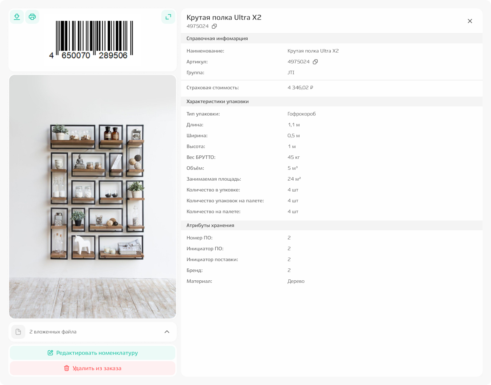{.center width=800}



### Событие 3.1.3. Сопоставление услуг

На данном шаге сопоставляются услуги. 

Можно выбрать услугу из предопределенного выпадающего списка, если услуги не были автоматически сопоставлены. 
**Добавить новую услугу нельзя**. 

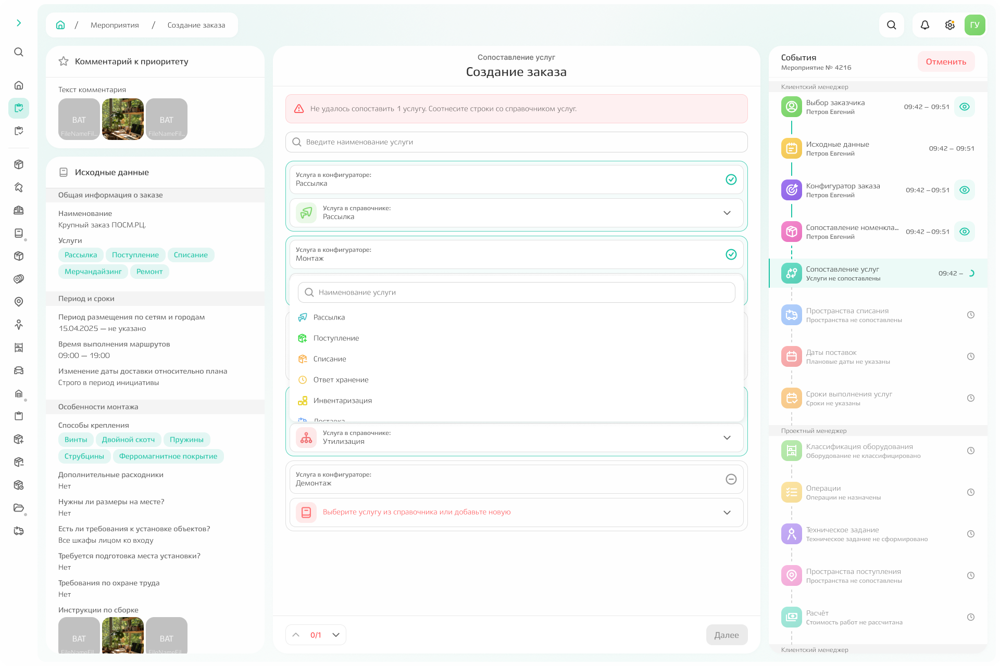{.center width=1200}

### Событие 3.1.4. Пространства списания
    
Несопоставленное пространство будет окрашено в красный, а вверху страницы появится уведомление.
Строка сопоставленного пространства будет выделена зеленым и отмечена галочкой, если сопоставился не тот адрес, то его можно поменять.
    


Пространство считается сопоставленным, если системе удалось подобрать и системное, и пользовательское пространство.

 

Для несопоставленного пространства необходимо создать или подобрать уже существующее системное пространство, затем — пользовательское.
 
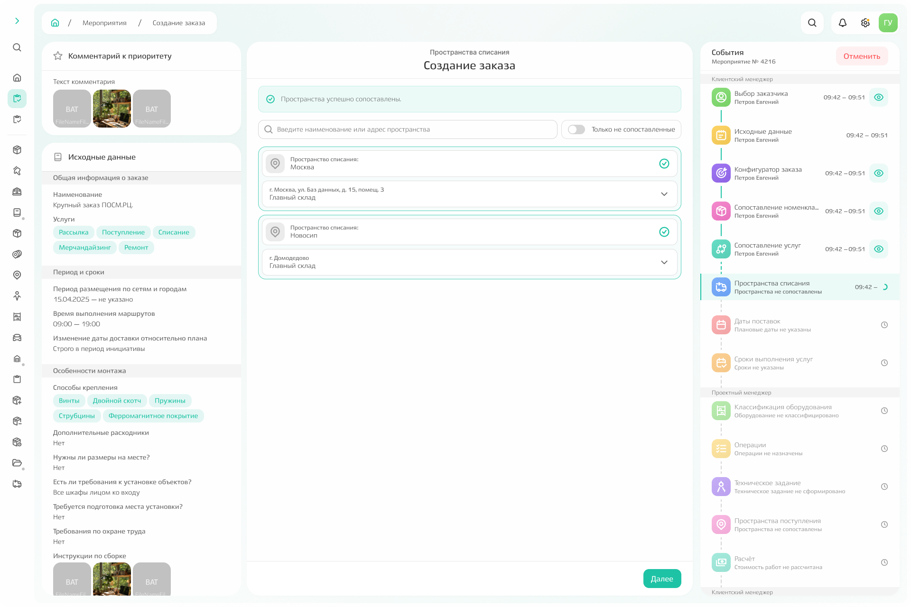{.center width=1200}  

### Событие 3.1.5. Даты поставок

Укажите плановые даты поступления номенклатуры. 
    
Можно указать несколько дат поставок, если номенклатура поставляется партиями. 
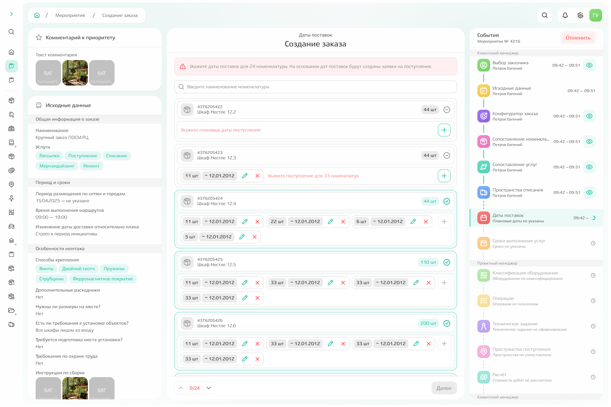{.center width=1200}

### Событие 3.2. Конфигуратор заказа  

**Настройка шаблона**
Первое, что необходимо сделать, — настроить поля для задачи. 

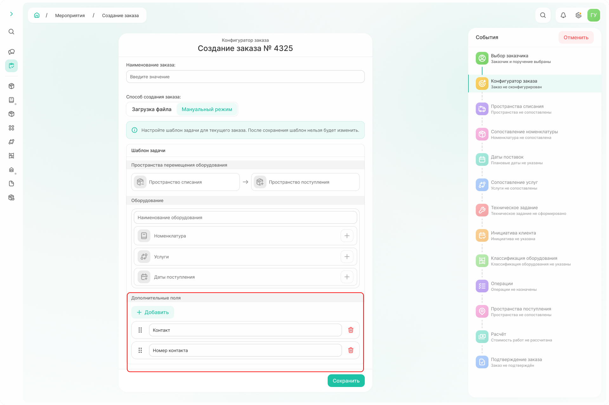{.center width=1200}

* Добавьте необходимые поля в разделе «Дополнительные поля». В карточке задачи поля будут отображаться в том порядке, в котором они добавлены. Порядок можно изменить, перетащив мышкой требуемое поле на нужное порядковое место.
* Если изменения не требуются или все поля уже добавлены, нажмите команду «Сохранить». После сохранения шаблон изменить нельзя.
  
**Добавление задач по заказу**
Начните создание заказа с внесения задач по команде «Добавить». 
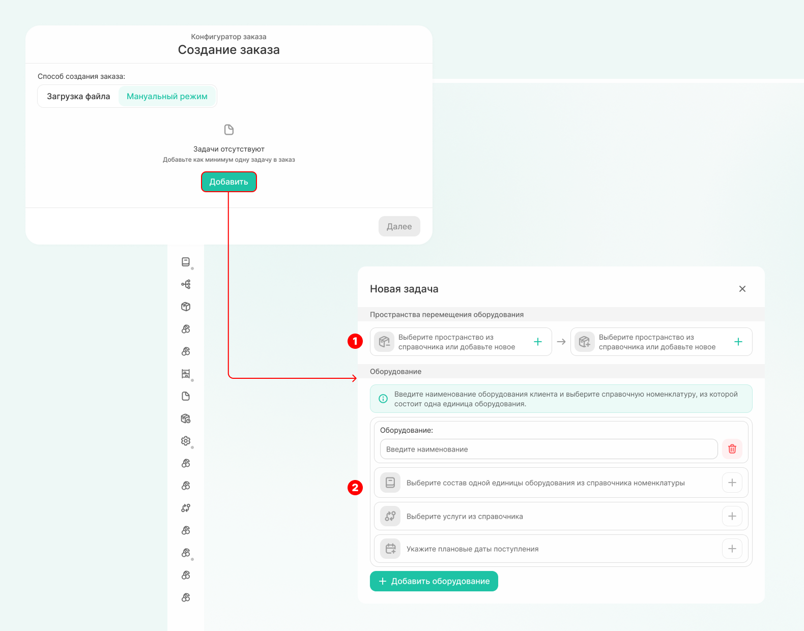{.center width=1200}

1. **Укажите пространства списания и поступления оборудования по команде «+».** 
Сначала выберите системное пространство (из справочника или создайте новое). Затем аналогичным образом добавьте пользовательское пространство.
**Топология при создании пространства из заявки не задаётся вручную.** Система по умолчанию создает зону погрузки, внести изменения и добавить описание всей иерархии можно позже, найдя созданное пространство в справочнике.
  
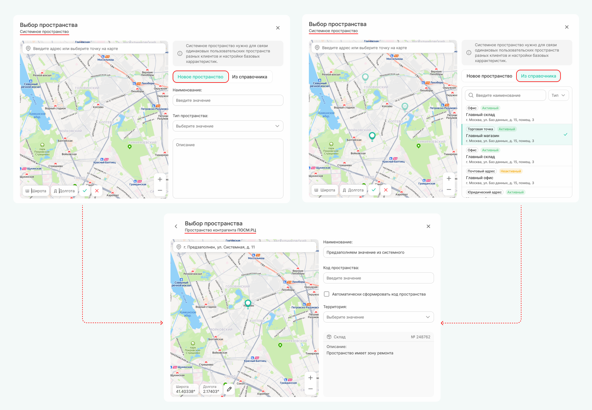{.center width=1200}

2. **Введите наименование оборудования клиента и выберите справочную номенклатуру,** из которой состоит единица оборудования, **а также добавьте услуги,** которые оказываются по одному оборудованию, **их количество и плановые даты поступления.**

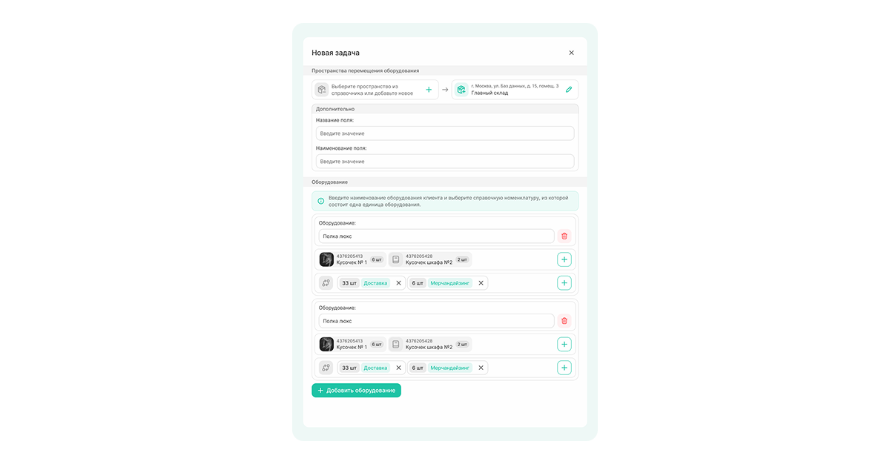{.center width=1200}

Когда вся информация по задаче внесена, воспользуйтесь командой «Добавить».
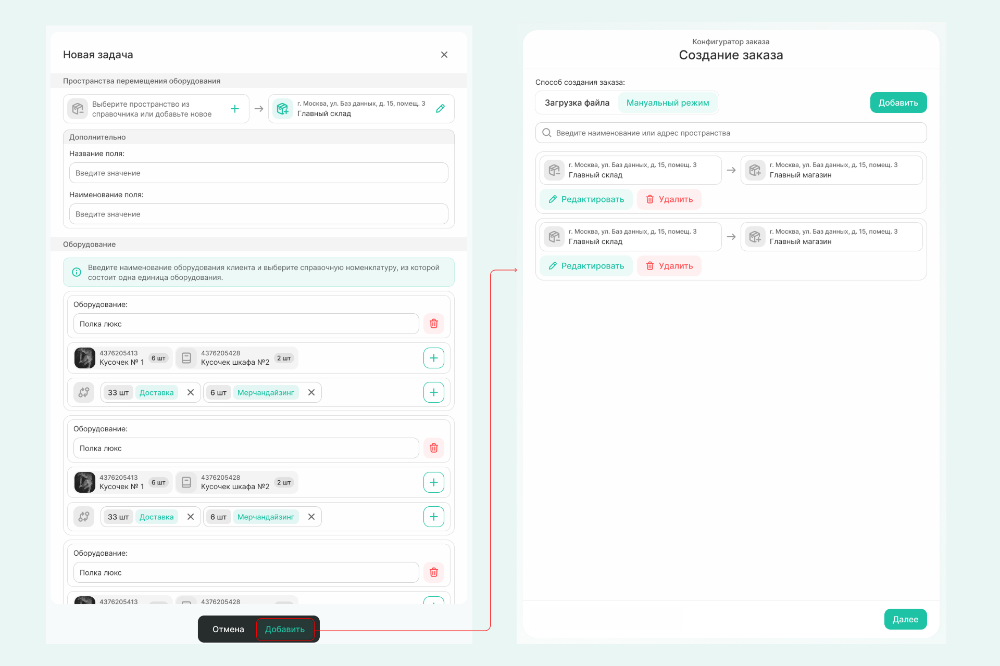{.center width=1200}



### Событие 4 Сроки выполнения услуг

На этом шаге необходимо указать планируемые даты начала и завершения для заказа, а также назначить ответственного.

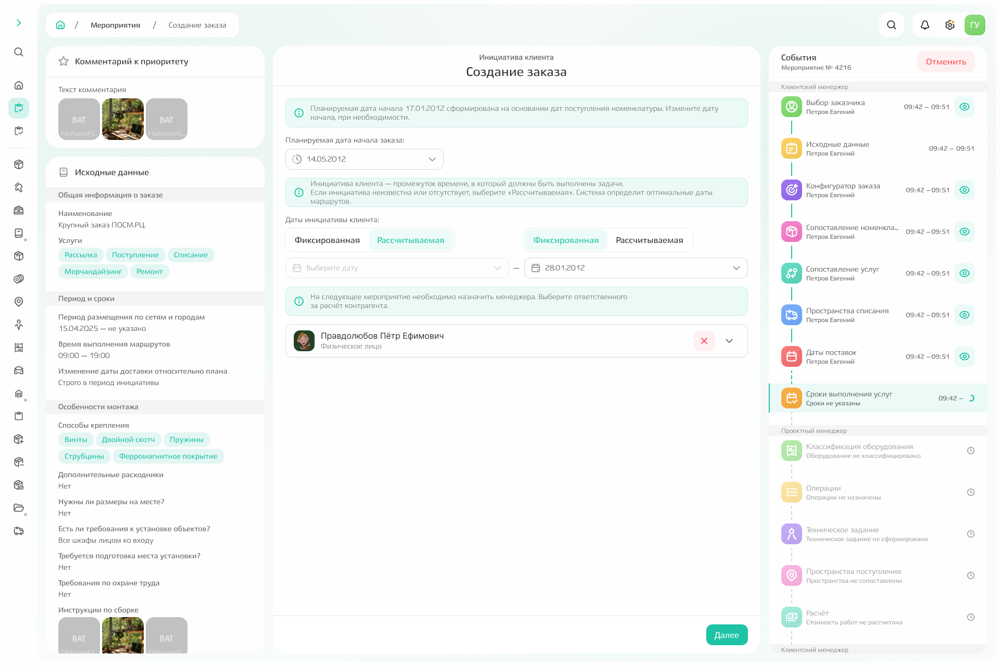{.center width=1200}

Для заказа **указывается планируемая дата начала.** Она формируется на основании даты поставки номенклатуры. При необходимости дату можно изменить, однако, выбрать число ранее текущего дня нельзя. 

**Инициатива клиента** — заданный клиентом срок, в который должны быть выполнены все задачи по заказу:  
- если инициатива известна, выберете тип «фиксированная» и укажите дату вручную;
- если инициатива неизвестна или отсутствует, выберите тип «рассчитываемая» и система сама определит оптимальную дату.

Для заказа указывается **ответственный менеджер** — контрагент, который будет отвечать за расчёт.
После того, как значение было выбрано, выводится окно с информацией об исполнителе по заказу.  
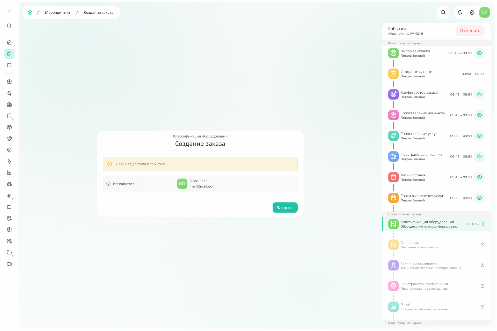{.center width=1200}

После создания заказа его статус отображается и отслеживается в подсистеме «Список заказов».

# Список заказов

В списке отображаются заказы, созданные в рамках договоров, где вы указаны как ответственный.

Для каждого заказа доступна следующая информация:
- заказчик;
- ответственный проектный менеджер;
- поручение, в рамках которого сформирован заказ;
- дата создания;
- статус;
- финансовый показатель — стоимость выполнения всех работ по заказу.

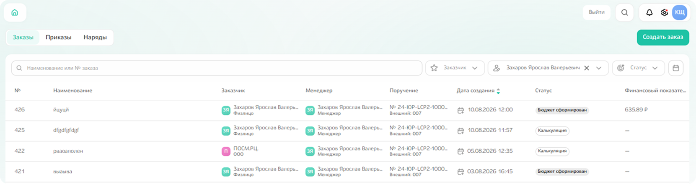{.center width=1200}



**Функционал отображения приказов и нарядов** в настоящее время находится в разработке.



 