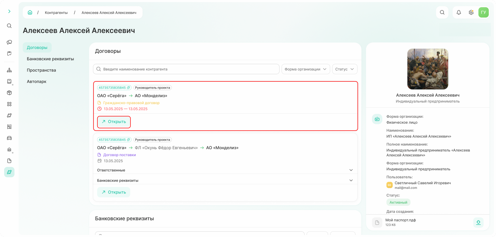
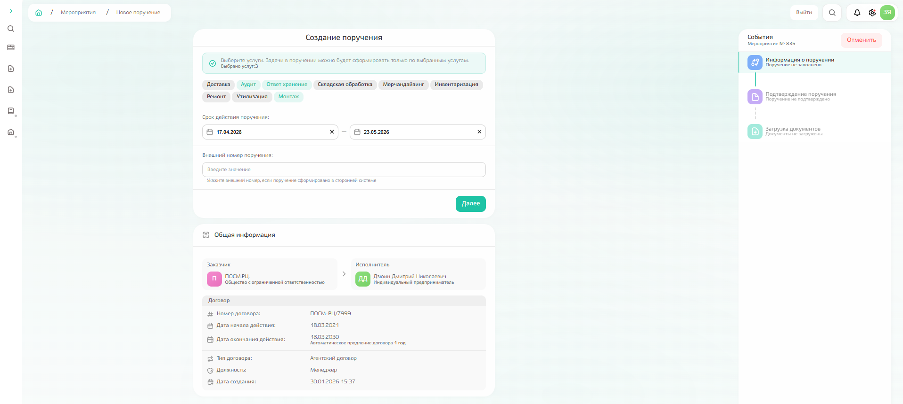
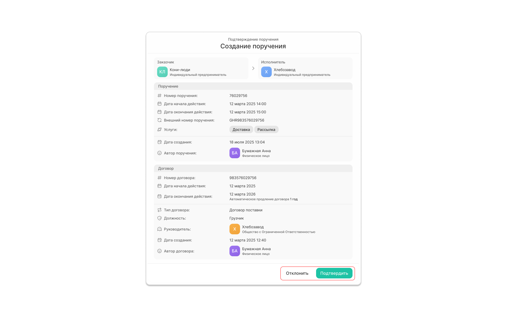
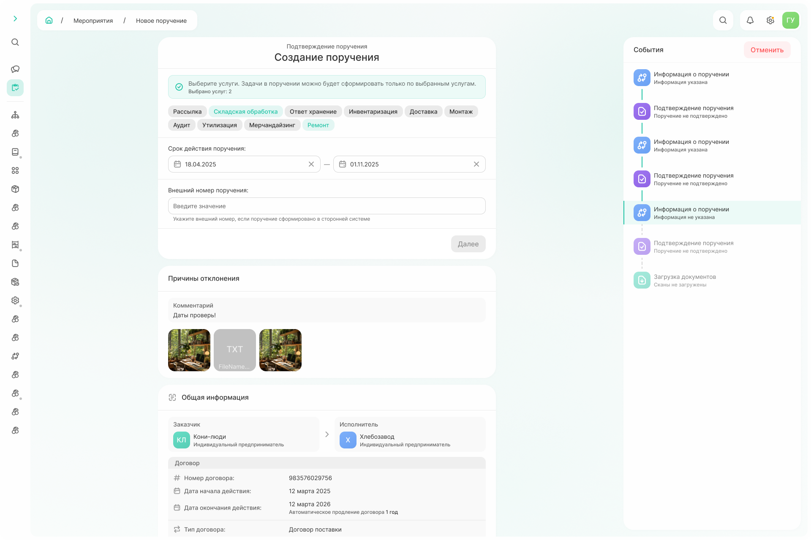
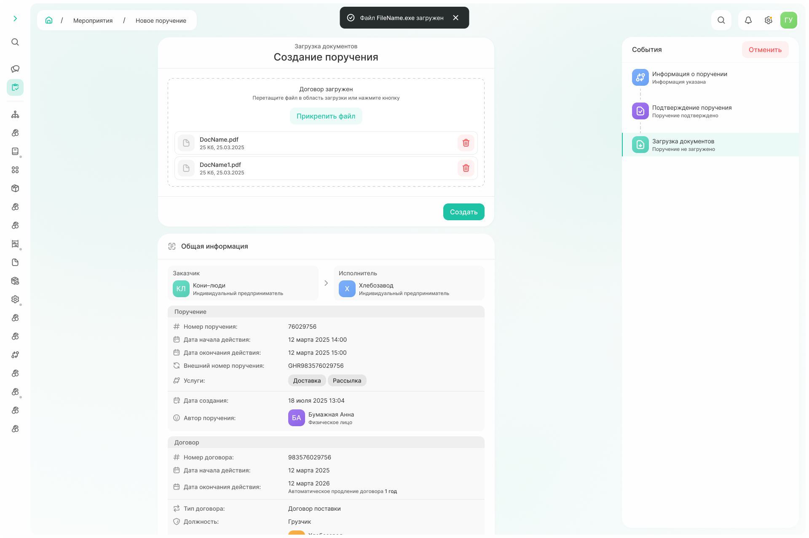
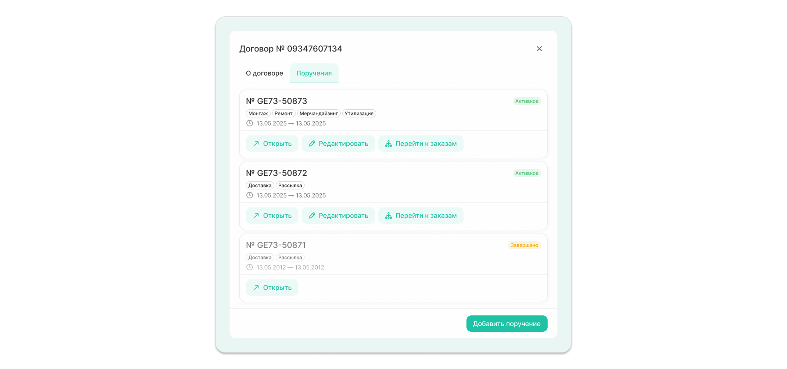
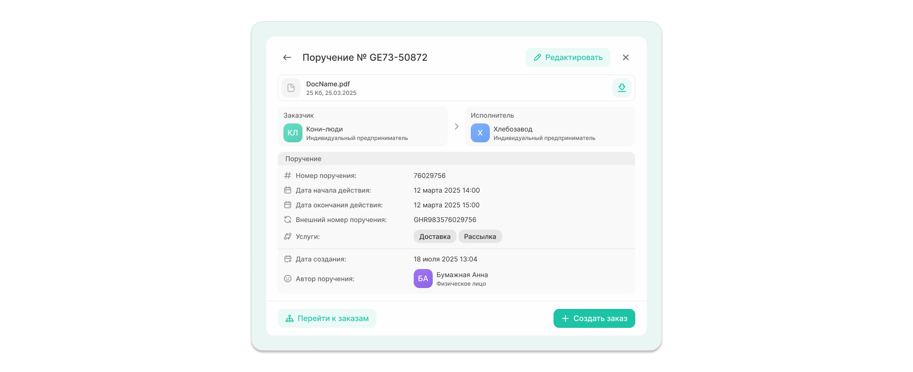

# Как создать поручение



**Поручение** — элемент управления, являющийся высокоуровневым указанием от клиента на выполнение услуг. 



Поручение **всегда создается в рамках договора**, поэтому для создания поручения необходимо в начале открыть договор, которому создаваемое поручение будет подчинено. 

Чтобы открыть договор, перейдите в подсистему «Справочники» → «Контрагенты», найдите строку с конкретным контрагентом, в интересах которого требуется создать поручение, далее кликните по нему и найдите раздел «Договоры». 
*Прим. Если у договора есть поручения, то в верхнем углу отобразится счетчик активных поручений к общему числу.*

{.center width=1200}

## Событие 1. Заполнение информации о поручении

Выберете договор, в рамках которого хотите создать поручение, и по команде «Открыть» → «Добавить поручение» откройте форму создания поручения.

Блок с общей информацией выводит информацию из выбранного договора.
Вам же необходимо указать:
- услуги: можно выбрать только среди указанных в договоре 
*Прим. выбранная услуга будет окрашена в зеленый цвет*;
- срок действия поручения;
- внешний номер поручения: заполняется, если поручение сформировано в сторонней системе.

{.center width=1200}

По команде «Далее» происходит переход к событию согласования поручения.  

## Событие 2. Согласование поручения



Сейчас **вы самостоятельно согласовываете своё поручение.** 
В будущем процесс изменится: поручение будет направляться на согласование генеральному директору, и приступить к работе можно будет только после его одобрения.



Поручение можно либо отклонить, либо подтвердить. 

{.center width=1200}

### При подтверждении

Происходит переход к следующему событию, на котором будет необходимо загрузить документы (событие 3).

### При отклонении

Необходимо указать причину отклонения и, при необходимости, прикрепить файлы для уточнения причины отказа;

{.center width=1200}



Поручение может быть отклонено несколько раз. Все изменения хранятся в системе: для просмотра переключайтесь между событиями в левой части экрана. 

{.center width=1200}

  

## Событие 3. Загрузка документов

Файл по поручению загружается в формате pdf по команде «Прикрепить файл» или перетаскиванием в область загрузки.   

{.center width=1200}

Создание поручения завершается по команде «Создать». 
Система выведет сообщение об успешном создании поручения с указанием внутреннего номера и возможностью просмотра информации (команда «Перейти к поручению»).

{.center width=1200}

## Просмотр информации о поручениях

Информацию о поручениях также можно посмотреть при выборе конкретного договора из карточки контрагента: если в рамках договора уже созданы поручения, будет отдельная вкладка «Поручения».

{.center width=1200}

Поручения можно просмотреть (команда «Открыть»), отредактировать (команда «Редактировать»), а также перейти к заказам, созданным в рамках этого поручения (команда «Перейти к заказам»).

К заказам можно перейти и при просмотре поручения, а также создать новый заказ.

{.center width=1200}

Создание заказа описано в отдельном разделе.
