# Заявки

Созданные заявки отображаются в подсистеме «Работа склада» → «Заявки».

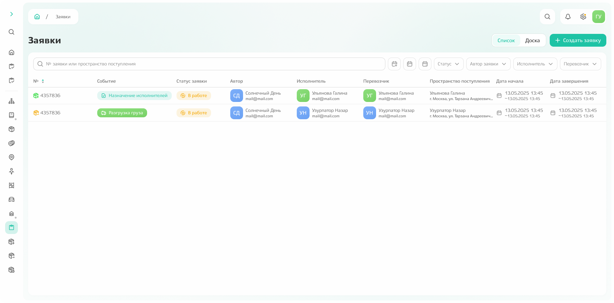{.center width=1200}

## Просмотр информации по заявкам

### Поиск и фильтрация

**Чтобы найти ранее созданную заявку (в работе или завершённую)**, используйте поисковую строку: введите номер заявки или наименование пространства поступления.

Также **можно отфильтровать список** по следующим параметрам:
- статус;
- автор заявки;
- исполнитель;
- перевозчик;
- дата создания;
- дата начала работ;
- дата завершения работ.

### Информация по заявке: статусы и события

Для каждой заявки отображаются:
- автор (контрагент, создавший заявку);
- исполнитель (контрагент, который сейчас работает по заявке);
- перевозчик;
- пространство поступления;
- даты начала и завершения;
- событие.

**Событие** — последовательность зафиксированных действий или этапов бизнес-процесса, отражающих ход выполнения. 
Например, **для заявки на поступление** цепочка событий выглядит следующим образом:
1. назначение исполнителей;
2. разгрузка груза;
3. приёмка груза;
4. фиксация габаритов; 
5. размещение товара;
6. проведение документов.
**Для заявки на списание** это:
1. назначение исполнителей;
2. отгрузка;
3. проведение документов.

По списку заявок сразу видно, на каком этапе находятся складские работы. При клике на заявку открывается подробная информация — там можно оценить ожидаемую длительность работ или найти контактные данные получателя для уточнения деталей.   

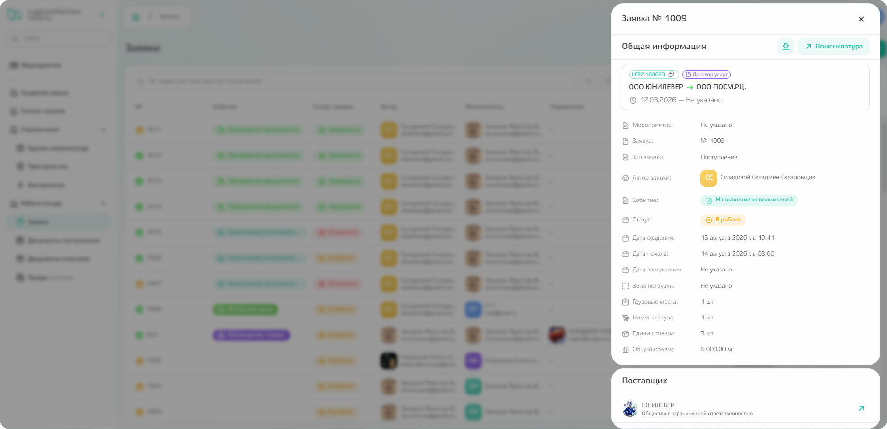{.center width=1200}



В списке отображены только те заявки, которые связаны с пространствами, к которым у вас есть доступ.



## Создание заявки

На странице доступна команда «Создать заявку» — она открывает форму для заполнения основной информации.

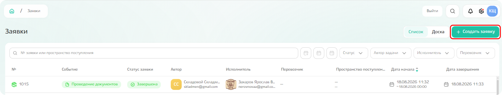{.center width=1200}



Заявки также **можно создавать и просматривать из подсистемы «Мероприятия».**
Мероприятие по работе с заявками отображается среди прочих доступных мероприятий. Чтобы создать заявку, перейдите: «Создать мероприятие» → «Работа склада».

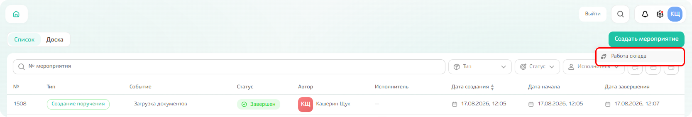{.center width=1200}



### Поступление

**На вкладке «Основное» указываются**
- тип заявки: поступление,
- планируемая дата начала работ по заявке,
- хранение для номенклатуры: длительное, кросс-докинг,
- комментарий: виден для исполнителей, при необходимости можно прикрепить файлы для конкретизации, 
- контрагент, который выполняет работу по заявке,
- договор, в рамках которого выполняется работа по заявке.

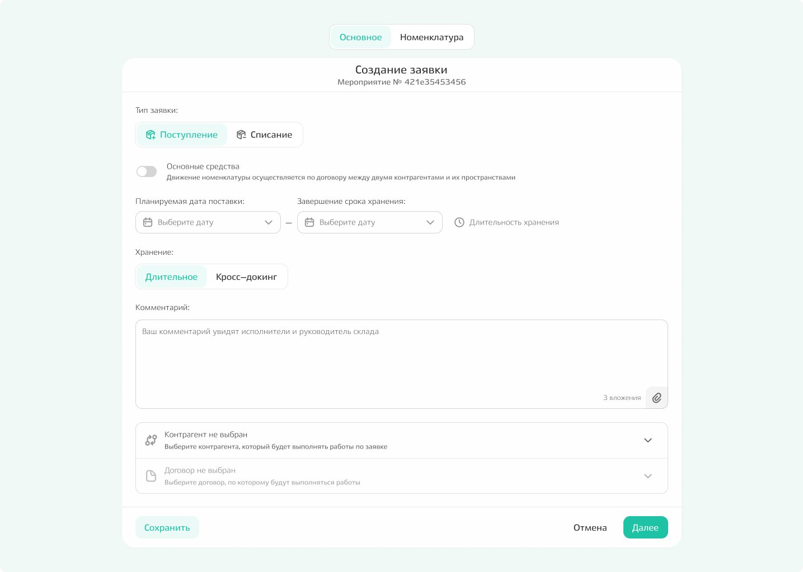{.center width=1200}

**После выбора договора появляются и предзаполняются поля «Поставщик» и «Получатель».** 
Можно указать пространство, откуда товар будет отгружен (для поля поставщика) и указать пространство, куда товар будет выгружен (поле получателя). 

**При наличии информации также заполняется поле «Перевозчик».** 
**Можно выполнить двумя способами:**
  1. Выбирается контрагент, ответственный за перевозку. После чего становятся доступными для заполнения поля, где указывается марка, страна и номер машины, а также серия и номер паспорта.
  2. По команде «Добавить» можно создать пользовательский контакт: в этом случае для перевозчика указывается ФИО, марка и номера машины, однако, данные по этому перевозчику сохранятся только для этой заявки, в следующих раз надо будет вводить информацию заново.        

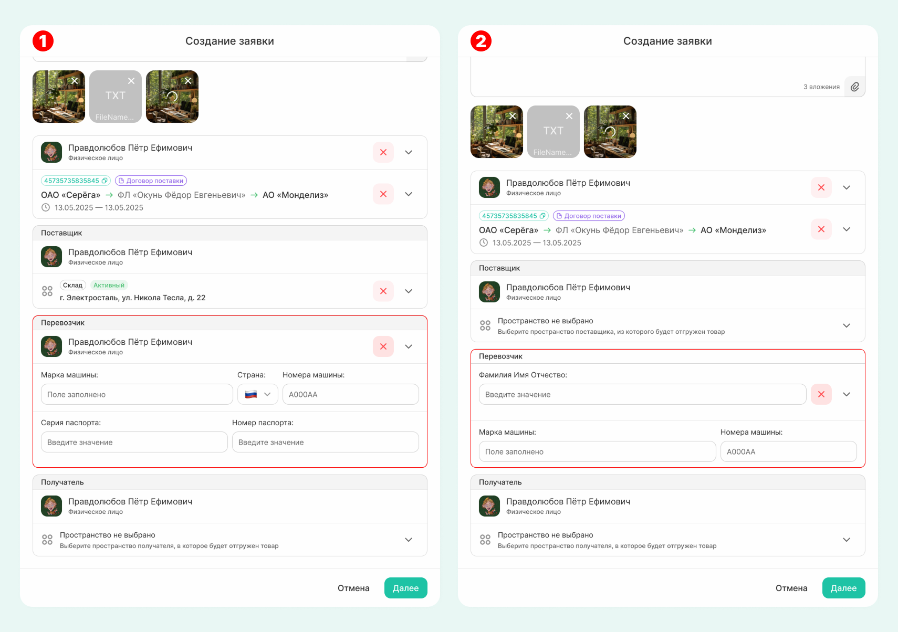{.center width=1200}



При помощи заявки **можно фиксировать поступление основных средств.** 
Для этого необходимо переключить свитчер «Основные средства» в значение TRUE (свитчер будет зеленым), а после указать 
- тип заявки: поступление,
- планируемую дату начала и завершения работ по заявке, 
- тип хранения, 
- оставить комментарии при необходимости,
- выбрать контрагента и закрепленное за ним пространство, куда основные средства будут зачислены. 
**Договор выбирать не нужно.**

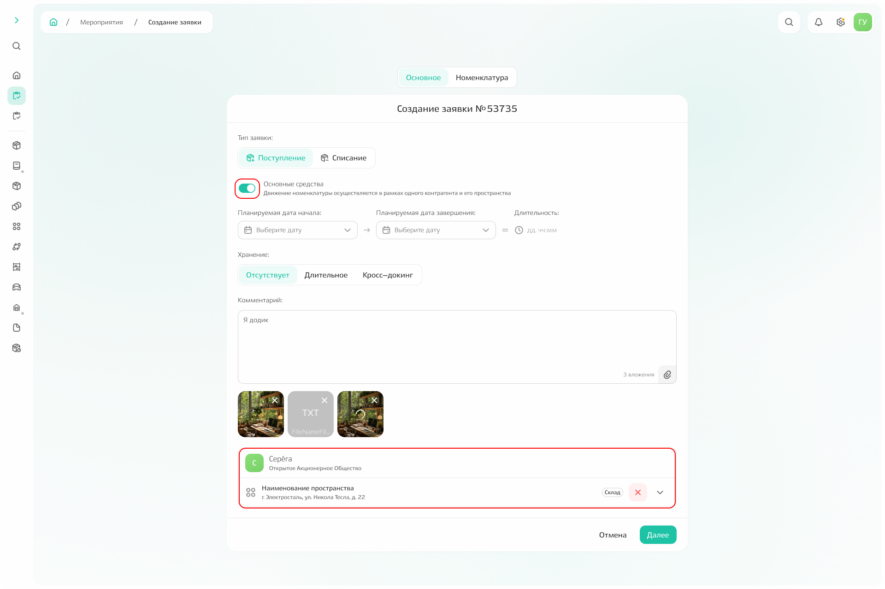{.center width=1200}



**На вкладке «Номенклатура»** введите в поиске наименование, артикул или SAP-код. 
Если номенклатура была обнаружена, то кликнете по значению в выпадающем списке, а в открывшемся модальном окне укажите тираж (количество поступающей номенклатуры) и, по возможности, укажите характеристики упаковки, в которой планируется поставка номенклатуры. 
*Если номенклатура не нашлась, то по команде «Добавить» можно создать новую номенклатуру. После внесения необходимой информации номенклатура будет добавлена не только в заявку, но и в справочник «Номенклатуры».*

После внесения всей информации сохраните выбранную номенклатуру в заявку.  
   
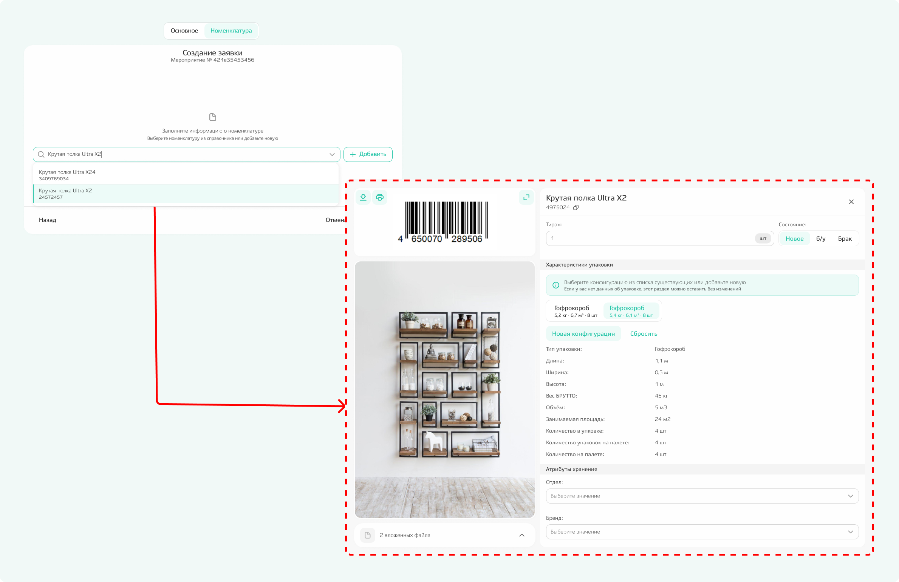{.center width=1200}

Когда вся номенклатура добавлена, нажмите команду «Создать».

{.center width=1200}



В интерфейсе также есть команда **«Сохранить»**. При клике по ней заявка сохраняется, но не запускается в работу. К ней можно вернуться позже из списка заявок и продолжить заполнение. 



**В момент создания заявки включается таймер.** Таймер фиксирует как общее время выполнения, так и время выполнения по каждому из этапов, а [прогресс-бар][8] над списком событий графически отражает как этапы соотносятся друг с другом по длительности. И таймер, и прогресс-бар будут отображены после клика по команде «Создать» при переходе к событию «Назначение исполнителей».  

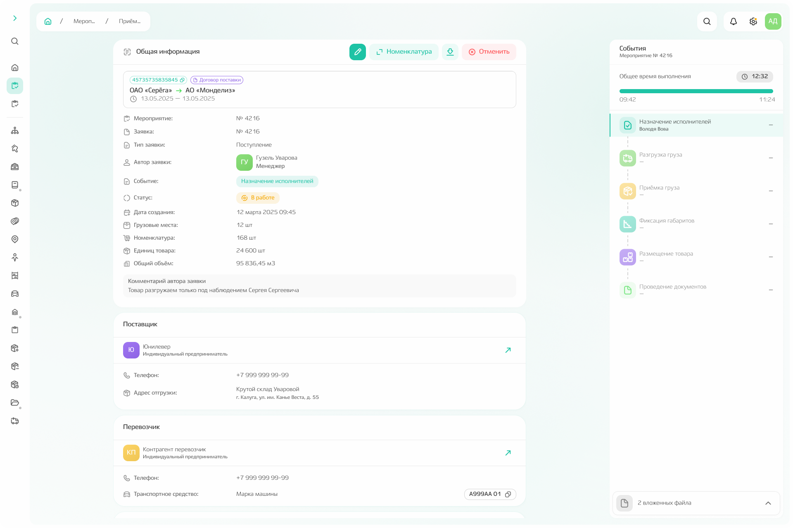{.center width=1200}

### Списание

**На вкладке «Основное» указываются:**
- тип заявки: списание;
- планируемая дата начала работ по заявке;
- причина списания: поставка, брак, бой, истечение срока годности;
- комментарий: виден для исполнителей, при необходимости можно прикрепить файлы для конкретизации; 
- контрагент, который выполняет работу по заявке;
- договор, в рамках которого выполняется работа по заявке.

{.center width=1200}

**После выбора договора появляются и предзаполняются поля «Поставщик» и «Получатель».** Вручную можно указать пространство, откуда товар будет отгружен (для поля поставщика) и указать пространство, куда товар будет выгружен (поле получателя). 

**При наличии информации заполняется поле «Перевозчик».**
Есть два способа:
1. Выбирается контрагент, ответственный за перевозку. После чего становятся доступными для заполнения поля, где указывается марка, страна и номер машины, а также серия и номер паспорта.
2. По команде «Добавить» можно создать пользовательский контакт: в этом случае для перевозчика указывается ФИО, марка и номера машины, однако, данные по этому перевозчику сохранятся только для этой заявки, в следующих раз надо будет вводить информацию заново.        

{.center width=1200}



При помощи заявки **можно фиксировать поступление основных средств.** 
Для этого необходимо переключить свитчер «Основные средства» в значение TRUE (свитчер будет зеленым), а после указать 
- тип заявки: списание;
- планируемую дату начала и завершения работ по заявке; 
- причину списания;
- оставить комментарии при необходимости;
- выбрать контрагента и закрепленное за ним пространство, откуда основные средства будут списаны. 
**Договор выбирать не нужно.**

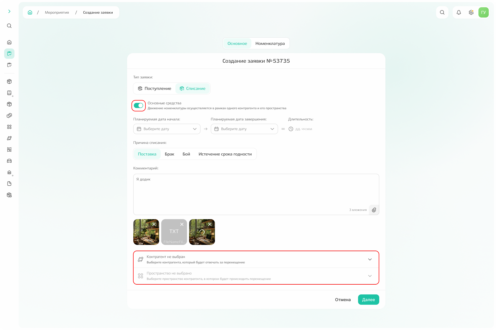{.center width=1200}



**На вкладке «Номенклатура»** введите в поиске наименование, артикул или SAP-код необходимой номенклатуры. Если номенклатура была обнаружена, то кликнете по значению в выпадающем списке, а в открывшемся модальном окне укажите количество номенклатуры, которое будет списано. После заполнения добавьте номенклатуру в заявку по команде «Сохранить».  
   
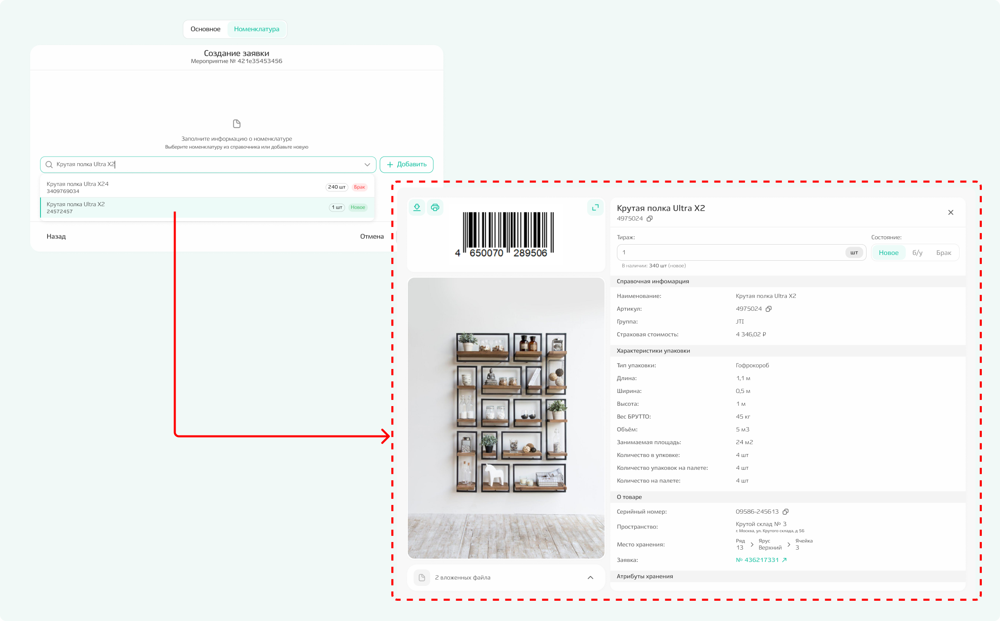{.center width=1200}

Когда вся номенклатура добавлена, нажмите команду «Создать».

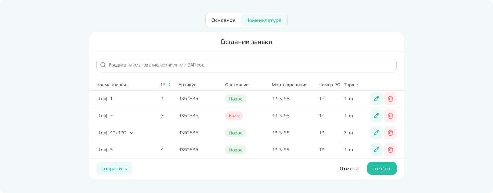{.center width=1200}



В интерфейсе также есть команда **«Сохранить»**. При клике по ней заявка сохраняется, но не запускается в работу. К ней можно вернуться позже из списка заявок и продолжить заполнение. 



**В момент создания заявки включается таймер.** Таймер фиксирует как общее время выполнения, так и время выполнения по каждому из этапов, а прогресс-бар над списком событий графически отражает как этапы соотносятся друг с другом по длительности. И таймер, и прогресс-бар будут отображены после клика по команде «Создать» при переходе к событию «Назначение исполнителей». 

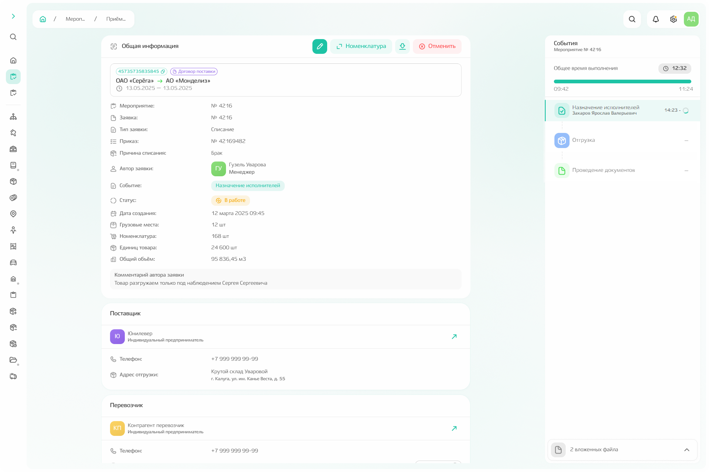{.center width=1200}

## Редактирование заявки



**Информацию о заявке можно отредактировать:**
* если заявка находится в статусе «Сохранено» для редактирования доступно любое поле;
* если заявка создана, но мероприятие «Разгрузка» для заявки на поступление или «Отгрузка» для заявки на списание не началось, для редактирования доступна информация о перевозчике, корретировка дат и изменение комментария;
* в любых других случаях редактирование недоступно.



Чтобы отредактировать заявку, кликните по той, для которой требуется изменение и кликните по иконке редактирования. Поля доступные для редактирования будут чуть ярче. После внесения изменений нажмите на команду «Сохранить». Отмена внесенных изменений происходит по команде «Отмена» рядом с командой «Сохранить». 

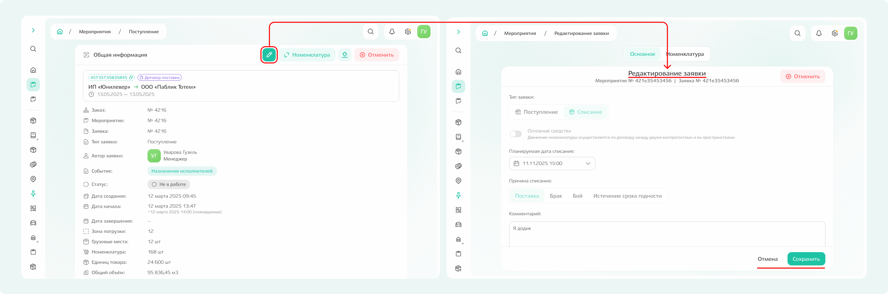{.center width=1200}

## Отмена заявки

**Заявку можно отменить, если** она имеет статус «В работе»: для отмены заявки кликните по нужной заявке в списке и нажмите команду «Отменить». 

**Заявку можно удалить, если** она имеет статус «Сохранена»: для удаления заявки кликните по нужной заявке в списке и нажмите команду «Удалить».

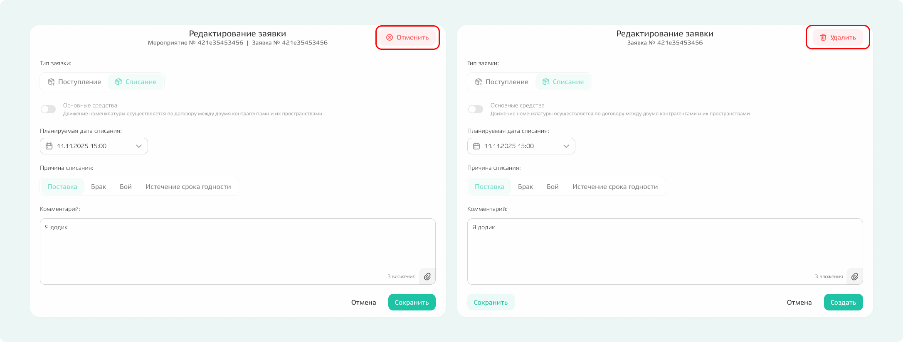{.center width=1200}